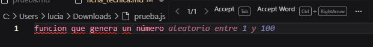
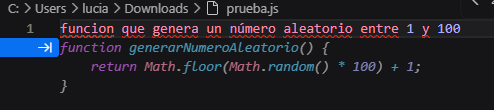
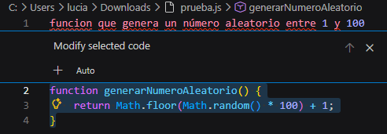
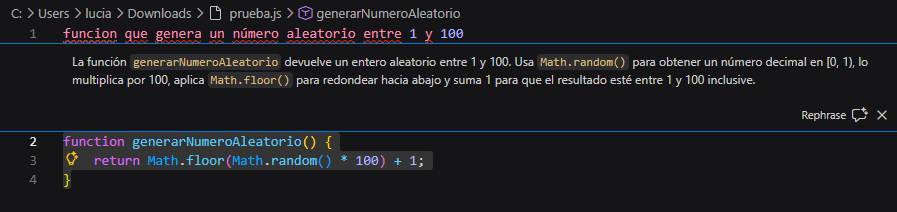
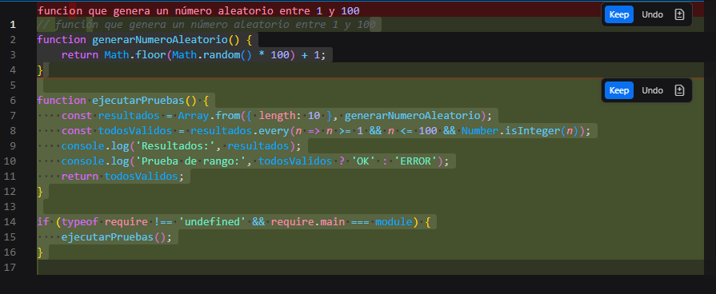

# Ficha Técnica: GitHub Copilot

## 1. Fuentes de información

- Github youtube chanel: [https://www.youtube.com/@GitHub](https://www.youtube.com/@GitHub)

- Docuemntación de Visual Studio Code: [https://code.visualstudio.com/docs/copilot/overview](https://code.visualstudio.com/docs/copilot/overview)

- Cursos de Microsoft Learn sobre Copilot: [https://learn.microsoft.com/en-us/training/paths/copilot/](https://learn.microsoft.com/en-us/training/paths/copilot/)

## 2. Definiciones
**AI Pair Programmer:** Significa “programador compañero con inteligencia artificial”.
Se refiere a que Copilot acompaña al desarrollador mientras programa, sugiriendo código, explicando errores y ayudando a resolver tareas.

**Code Completion:** Función que permite completar código automáticamente mientras el usuario escribe. Copilot puede sugerir desde una línea hasta funciones completas, según el contexto.

**NES:** Sigla de Next Edit Suggestions. Función que anticipa la próxima edición que probablemente el desarrollador querrá realizar. No solo completa código nuevo, sino que puede sugerir cambios relacionados en otras partes del archivo o proyecto.

**Copilot Chat:** Interfaz conversacional de GitHub Copilot. Permite hacer preguntas y pedir tareas. 

**Inline Chat:** Chat integrado directamente en el archivo de código. Permite pedir acciones rápidas sobre una selección de código sin abrir el panel lateral completo. 

**Slash commands:** Comandos rápidos que se usan en Copilot Chat escribiendo `/`.   
Ejemplos:

- `/explain` → explica código seleccionado.

- `/tests` → genera tests.

- `/suggest` → ofrece sugerencias.

- `/comment` → genera código a partir de comentarios.


**Pull Request:** Solicitud para integrar cambios de una rama a otra dentro de un repositorio. Permite revisar cambios antes de incorporarlos al proyecto principal.

**Pull Request Summary:** Resumen automático generado por Copilot para describir los cambios realizados en una Pull Request. Ayuda a los revisores a entender más rápido el propósito de la modificación. Disponible para planes pagos.

**Code Review:** Proceso de revisión de código realizado antes de integrar cambios al proyecto.Busca detectar errores, mejorar calidad, validar requisitos y mantener estándares del equipo.

**Code Review Assistance:** Funcionalidad de Copilot que ayuda durante la revisión de código.  Puede señalar posibles problemas, sugerir mejoras y comentar sobre cambios en una Pull Request.

**CLI:** Sigla de Command Line Interface.
Es la terminal desde donde se ejecutan comandos para trabajar con archivos, proyectos, Git, servidores, herramientas y scripts.

**Copilot for CLI:** Función de Copilot que asiste al usuario desde la terminal. Puede sugerir comandos, explicar errores y generar scripts.

**Agent Mode:** Modo avanzado de Copilot Chat en el editor. Permite que Copilot no solo responda preguntas, sino que también actúe sobre el proyecto, proponga cambios en archivos y avance en tareas de varios pasos.

**Copilot Cloud Agent:** Agente autónomo de Copilot que trabaja en la nube sobre repositorios de GitHub. Puede tomar tareas, modificar código y abrir Pull Requests.

**Custom Agent:** Agente personalizado de Copilot. Se configura para seguir instrucciones específicas, estándares del equipo o tareas concretas.

**Solicitudes premium:** Uso de modelos o funciones avanzadas de Copilot que pueden tener límites mensuales según el plan contratado.

## 3. Demostración Practica
Como algunas funcionalidades de GitHub Copilot requieren planes pagos o acceso educativo, la demostración se realizará combinando:
1. Una demostración propia con Copilot Free.
2. Videos para mostrar como usar funciones no disponibles en el plan gratuito.
3. Una explicación de cómo acceder al plan Pro para estudiantes.

### 1. Demostraciones
**Editor:** Visual Studio Code

**Extension:** Github Copilot y Github Copilot Chat


#### Inline Suggestions  
Se escribe un comentario describiendo una función y Copilot interpreta el comentario, el contexto del archivo, y propone una implementación. El desarrollador puede aceptar `Tab` o aceptar parcialmente `CTRL`+`→`, ver distintas sugerencias (colocando el mouse sobre la implementación sugerida y desplazándote entre las soluciones), modificar o rechazar la sugerencia.
Ejemplo:

Copilot puede sugerir algo como:


#### Inline Chat
Seleccionas una función y abrís el inline chat con `CTRL` + `I` o con click derecho y seleccionando la opción *Open Inline Copilot*.
A diferencia del chat lateral, aparece directamente sobre el código seleccionado. Permite pedirle a Copilot acciones rápidas, como explicar una función, refactorizarla o generar tests.
Ejemplo:


##### Para explicación de código
Se usa el comando `/explain` y se obtiene lo siguiente:


##### Para generación de tests
Se generan propuestas de tests unitarios. Esto no significa que los tests sean automáticamente correctos, pero ayuda a acelerar el proceso y a pensar casos que deberían verificarse.

Se usa el comando `tests`:



### 2. Demostraciones de funciones pagas

#### Resumen de Pull Request
[](https://www.youtube.com/watch?v=hWYUbvB7Zk8)

#### Code Review
[](https://www.youtube.com/watch?v=cyPaAkRfEBQ)

#### Copilot Cloude Agent
[](https://www.youtube.com/watch?v=pn5x1CamKVY)

#### Custom Agents
[](https://www.youtube.com/watch?v=onVn-lnHZ9s&t=142s)

#### Copilot Spaces
[](https://www.youtube.com/watch?v=6pbdTiT-Pcg)

## 3. Recomendaciones de uso
Para aprovechar GitHub Copilot es importante utilizarlo como una herramienta para el  desarrollo y no como un reemplazo del criterio propio del programador.

### Revisar siempre el código generado

Las sugerencias de Copilot deben ser revisadas antes de aceptarse. Aunque puede generar código útil, también puede producir soluciones incorrectas, incompletas o que no respeten los requisitos del proyecto.

**Recomendación:** aceptar una sugerencia solo después de entender qué hace y verificar que cumple con lo esperado.

### Probar el código antes de integrarlo

Todo código generado o modificado con ayuda de Copilot debe ser probado.

Esto incluye:

- ejecutar el programa
- probar casos normales
- probar casos borde
- verificar errores esperados
- ejecutar tests unitarios si existen

Copilot puede ayudar a generar pruebas, pero el desarrollador debe revisar si esas pruebas realmente validan el comportamiento correcto.

### Dar instrucciones claras y específicas

Copilot funciona mejor cuando recibe contexto suficiente.

En vez de pedir:

> “Hacé esta función”

conviene pedir:

> “Implementá una función que reciba una lista de números enteros y devuelva el promedio. Si la lista está vacía, debe devolver 0.”

Cuanto más clara sea la consigna, mejor va a serla respuesta.

### Usar comentarios descriptivos

Una buena práctica es escribir comentarios que expliquen la intención del código antes de pedirle ayuda a Copilot.

Por ejemplo:

```js
// Función que valida si el email tiene el formato correcto
````
## 4. Recursos de aprendizaje

Para profundizar en el uso de GitHub Copilot, se recomiendan los siguientes recursos oficiales y complementarios.

### GitHub Learn

GitHub Learn reúne rutas de aprendizaje, cursos y recursos oficiales sobre GitHub y GitHub Copilot.

- [GitHub Learn](https://learn.github.com/)
- [Essentials of GitHub Copilot](https://learn.github.com/learning-pathways/github-copilot)
- [Courses - GitHub Learn](https://learn.github.com/courses)

### GitHub Skills

GitHub Skills ofrece cursos interactivos y prácticos. Permite aprender usando repositorios reales, issues y GitHub Actions.

- [Getting started with GitHub Copilot](https://github.com/skills/getting-started-with-github-copilot)
- [GitHub Skills](https://github.com/skills)

Este recurso es útil para practicar el uso de Copilot en un flujo de trabajo similar al real.


### Microsoft Learn

Microsoft Learn ofrece módulos y rutas de aprendizaje gratuitas sobre GitHub Copilot. Es uno de los recursos más recomendables para comenzar, porque organiza el contenido por unidades, objetivos de aprendizaje y  dificultad.
Recursos recomendados:

- [Introducción a GitHub Copilot](https://learn.microsoft.com/es-es/training/modules/introduction-to-github-copilot/)
- [Curso GH-300T00-A: GitHub Copilot](https://learn.microsoft.com/en-us/training/courses/gh-300t00)
- [Microsoft Learn – Cursos y módulos sobre GitHub Copilot](https://learn.microsoft.com/en-us/training/browse/?products=github&terms=copilot):  cursos oficiales de Microsoft relacionados con GitHub Copilot.

### Documentación oficial de GitHub Copilot

[Documentación oficial de GitHub Copilot](https://docs.github.com/copilot)

La documentación oficial de GitHub es el recurso más importante para consultar información actualizada sobre funciones, planes, configuración, privacidad, seguridad y uso responsable.

### Canal oficial de GitHub en YouTube

El canal oficial de GitHub en YouTube incluye tutoriales, demostraciones, charlas y videos sobre GitHub Copilot, GitHub Actions, buenas prácticas de desarrollo y novedades del ecosistema GitHub.

[Canal oficial de GitHub en YouTube](https://www.youtube.com/@GitHub)
